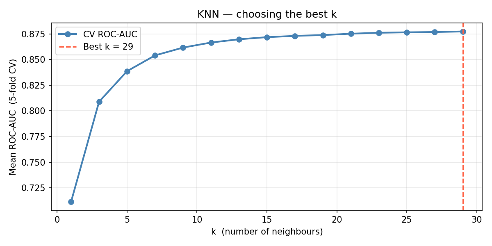
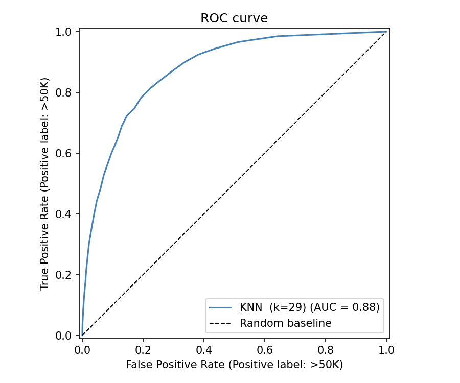
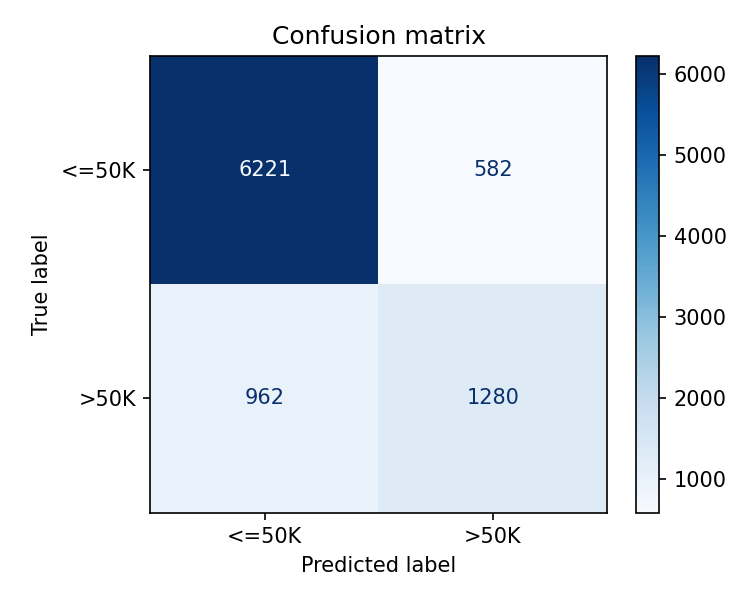
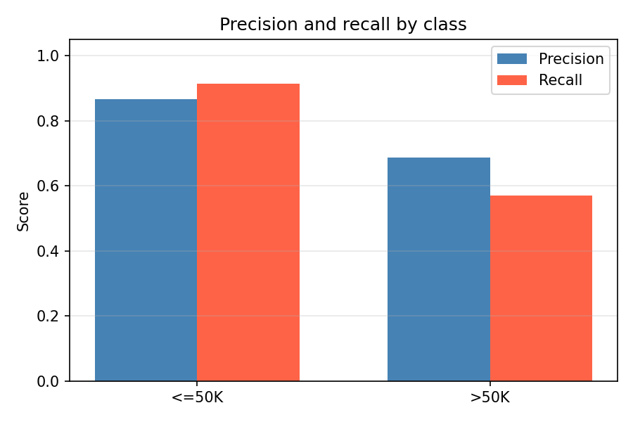

# KNN — Adult Income Classification

Dataset: UCI Adult Census Income  
Algorithm: K-Nearest Neighbors  
Task: Binary classification — predict whether income exceeds $50K

## Results
| Metric | Score |
|--------|-------|
| ROC-AUC | ~88% |
| Best k | 29 |

## Plots

## Key concepts covered
- Data leakage through premature encoder and scaler fitting
- k selection via cross-validated ROC-AUC
- Why accuracy is misleading on imbalanced datasets
- Class imbalance in income prediction