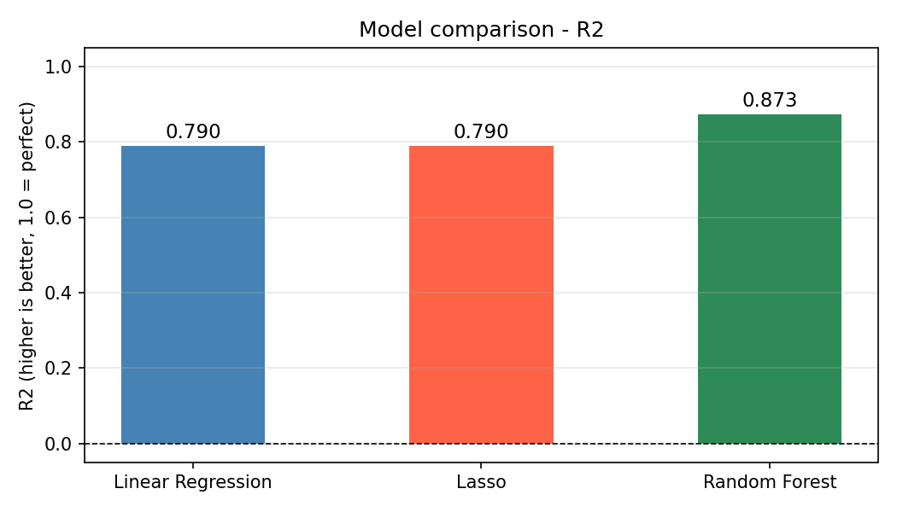
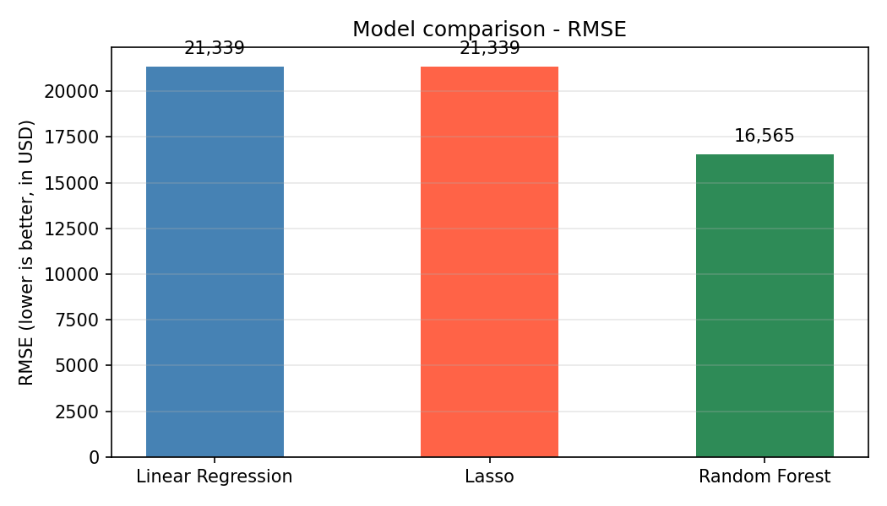
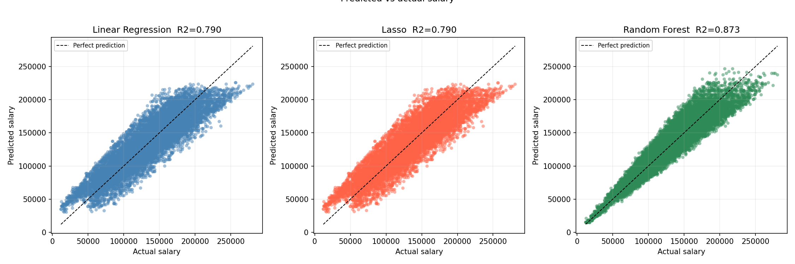
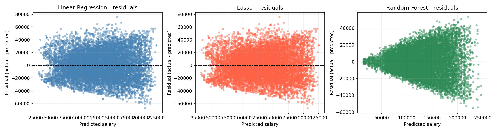
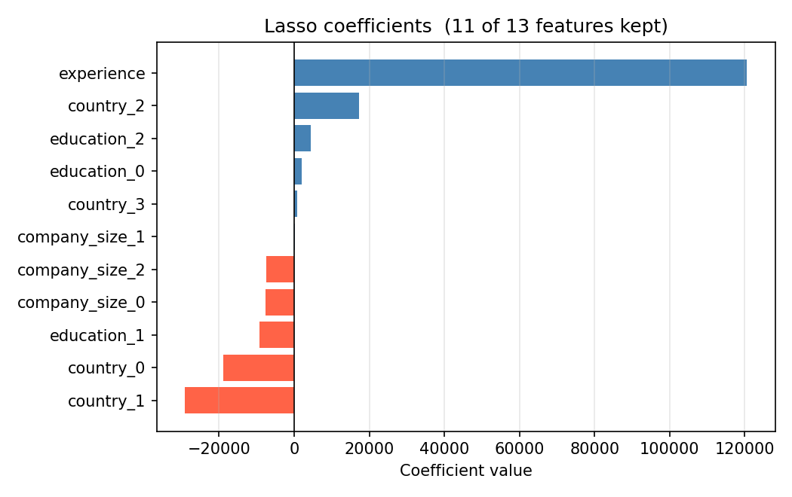
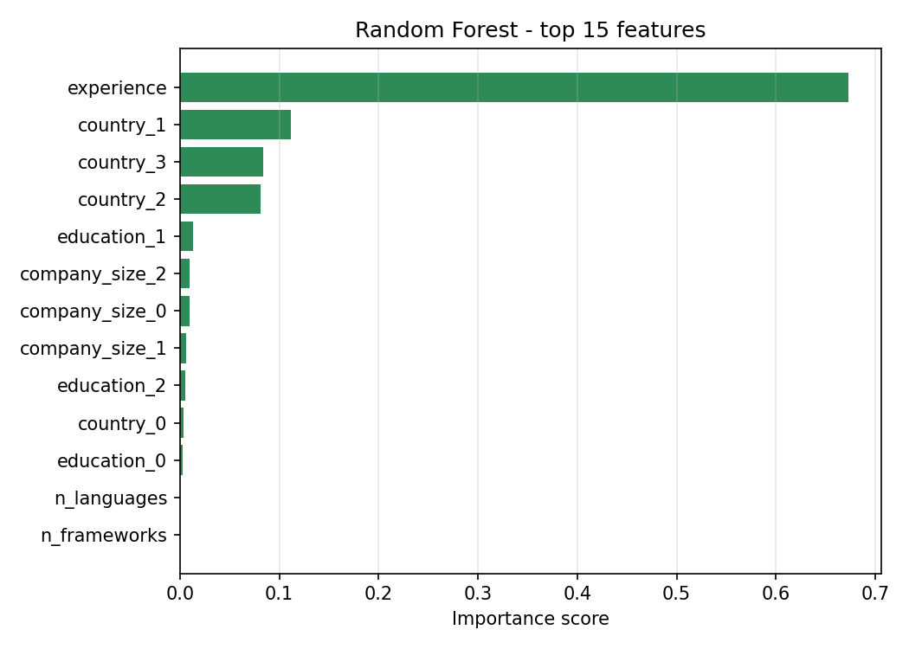

# Regression Comparison — Software Engineer Salary

Dataset: Software engineer salaries with experience, country, education, languages and frameworks  
Algorithms: Linear Regression, Lasso, Random Forest Regressor  
Task: Predict salary in USD

## Results
| Model | R2 | RMSE |
|-------|----|------|
| Linear Regression | - | - |
| Lasso | - | - |
| Random Forest | - | - |

## Plots

## Key concepts covered
- Feature engineering on comma-separated multi-label columns
- Lasso automatic feature selection via lambda penalization
- Why Random Forest does not need scaling
- R2 and RMSE as regression metrics
- Residual analysis to diagnose model behavior