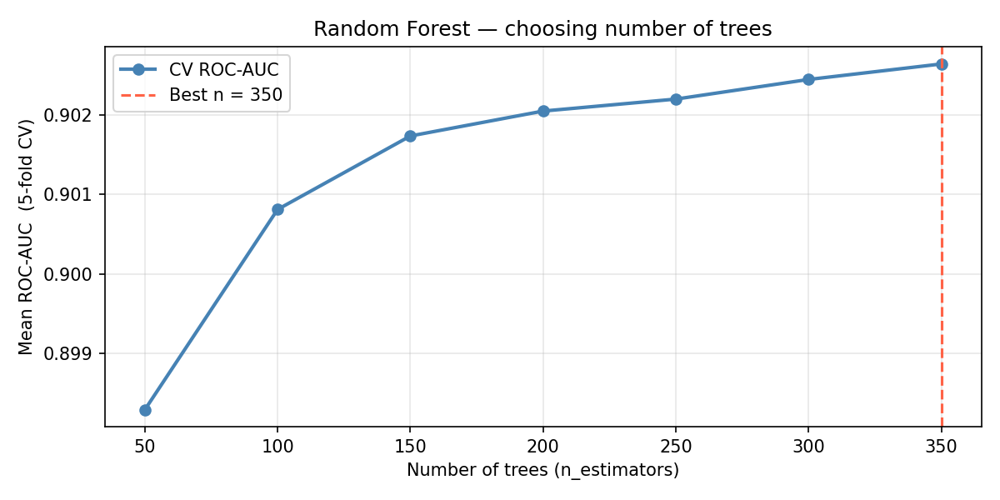
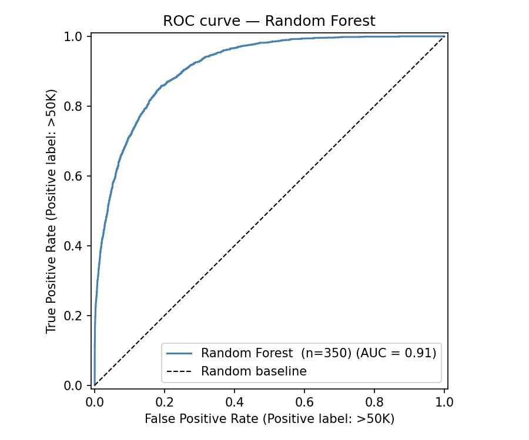
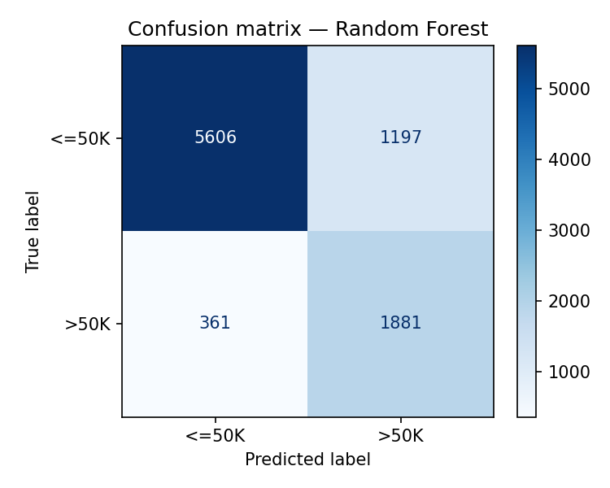
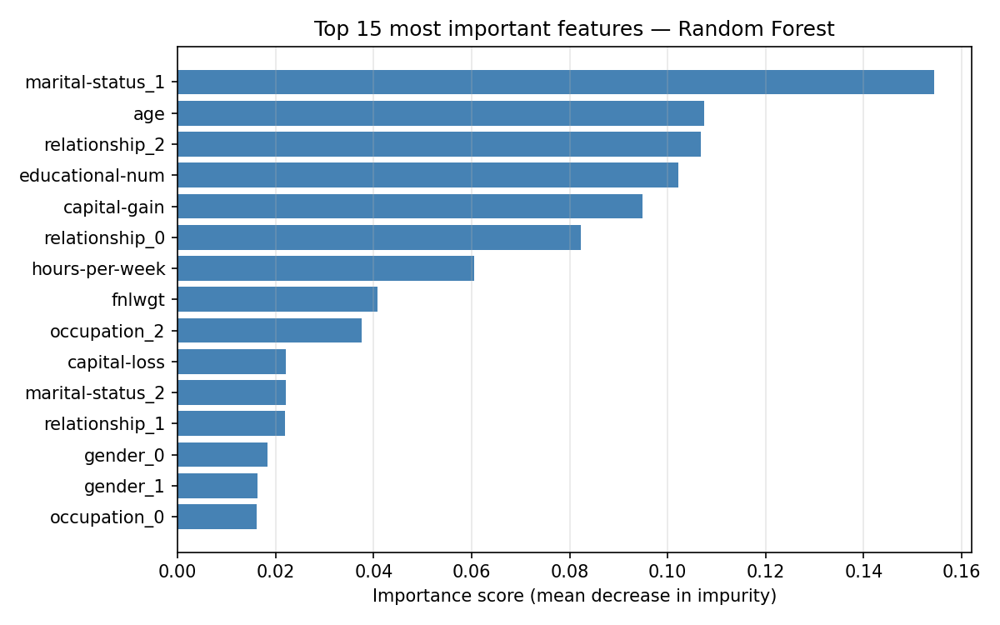
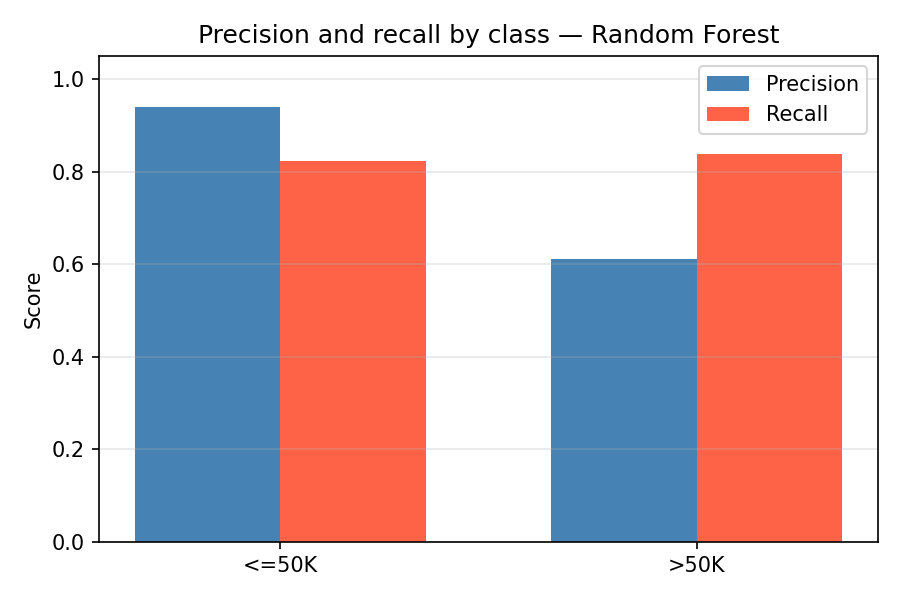

# Random Forest — Adult Income Classification

Dataset: UCI Adult Census Income  
Algorithm: Random Forest Classifier  
Task: Binary classification — predict whether income exceeds $50K

## Results
| Metric | Score |
|--------|-------|
| ROC-AUC | ~91% |
| Best n_estimators | tuned via CV |

## Plots

## Key concepts covered
- Why tree-based models do not require scaling
- Class weighting for imbalanced targets
- Feature importance as a native model output
- Hyperparameter roles: n_estimators, max_depth, min_samples_leaf, class_weight